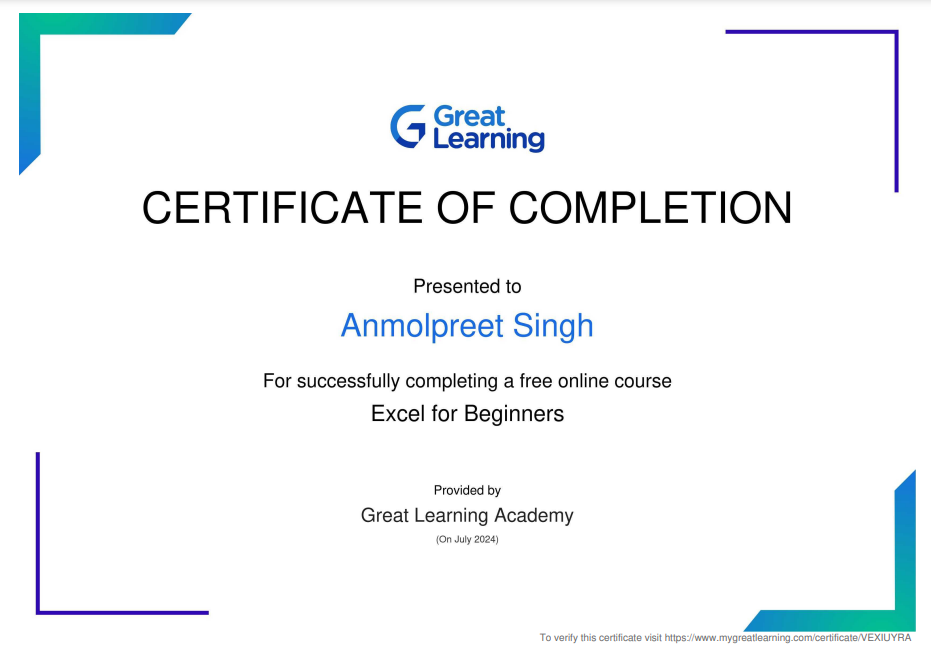

# Anmolpreet Singh

## About
I am Anmolpreet Singh, a dreamer looking to succeed in Technology Industry. I find Computers, Coding and Artificial Intelligence quite fascinating and looking to make it a career. 

## Academic History

Education Milestones | Institute | Year | Percentage
------------ | ------------- | ------------- | -------------
10th | Akal Galaxy Convent School | 2021 | 95.5
12th | BCM Arya Model Sr. Sec. School | 2023 | 89.8
B.Tech in Computer Science | Guru Nanak Dev Engineering College | 2024-Present | -

## Programming Languages:

* Python: I have some basic knowledge of Data Handling using Pandas, Data Visualisation using Matplotlib

## Data Management System: 

* MySQL: Experienced in Data Storage, Management and Manipulation using SQL.

## Excel Course

[Read full experience here](excel.md)

## Interests: 

* Computers
* Coding
* Artificial Intelligence
* Cricket

## Also Read: 

[My Experience at GNDEC](https://singhanmolpreet.github.io/myexperience/)

[My Excel Course Experience](excel.md)
