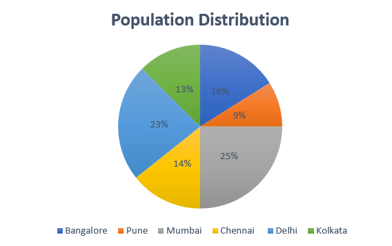

# Excel Course Experience

It was a great learning experience for me as I learnt several new tools and functions in excel which I did not know about. These functions will definitely make my working on excel a lot easier from now. Some of the concepts I learned are: Cell Referencing, Using existing functions and creating own functions, Sorting, Filtering, Date and Time, If else conditions, Round off and Data Visualisation using different graphs. Here are some of the graphs I made using excel: 

